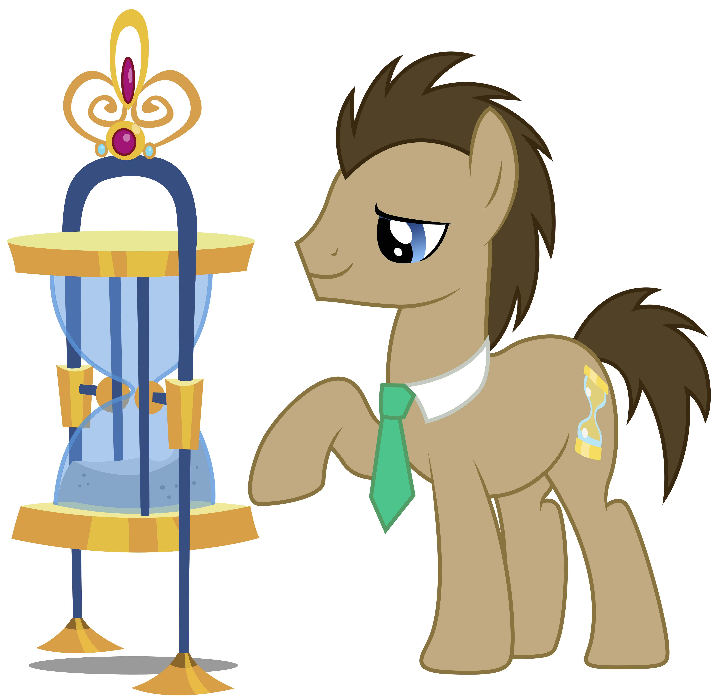
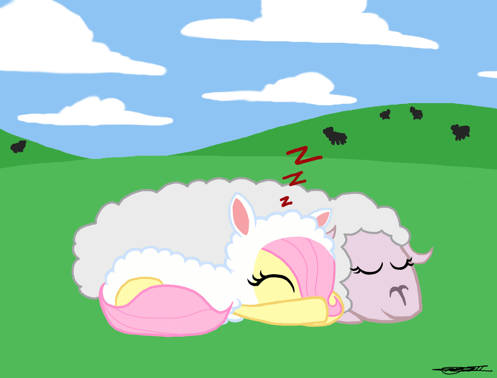

# Une (brève) histoire du temps {#Cover}

*Historique des standards du temps, par [Julien Tanguy](http://twitter.com/jutanguy)*
<!-- source: https://en.wikipedia.org/wiki/Black_hole  -->

## **tempus fugit**

## Mesure du temps

- Rôle important dans l'organisation de la vie sociale
- Observations astronomiques
    - Soleil: Jour, Année
    - Lune: Mois

{:.note}
La minute vient du latin _minuta_, partie menue de la division

// La mesure du temps a longtemps été l'apanage des astronomes. Les observations étaient à l'origine sommaires.

## Sur les rives de Babylone

- Calendrier lunaire, puis luni-solaire
- 1 an = 12 mois
- 1 mois intercalaire supplémentaire les années 3, 6, 8, 11, 14, 17 et 19
- Subdivisions du jour: 1 jour = 12 danna, 1 danna = 30 ush, 1 ush = 60 nindan

{:.note}
Le mot seconde vient de "seconde subdivision par 60 d'une heure"

// Les permiers calendriers étaient basés sur le cycle lunaire; ce dernier définit la notion de mois
// A cause du décalage des cycles lunaires et solaires, il a fallu rajouter des mois intercalaires pour corriger le décalage des saisons.
// Cycle métonique: hyperpériode des cycles lunaires et solaires

## Du côté du phare d'Alexandrie

- 1 an = 12 mois de 30 jours + 5 jours
- La nuit est divisée en 12h
    - Le ciel était divisé en 36 décans
    - Seulement 12 étaient observables en une nuit
- Le jour a été divisé en 12h par symmétrie de la nuit

{:.note}
Nos 24 heures sont égyptiennes

// La première période a être subdivisée en 12h a été la nuit

## Calendriers

- Lunaire: musulman
- Luni-solaire: chinois, hébraïque, tibétain
- Solaire: julien, grégorien

{:.note}
Le calendrier grégorien, instauré le 15 octobre 1582, ne remplace pas les dates antérieures

## Jour julien {#Julien}

- Créé par Joseph Juste Scaliger, en l'honneur de Jules César Scaliger
- Compté en nombres de jours + fraction de jour par rapport à une origine
- Origine du jour julien: 1 janvier -4712 à midi
    - Avant la totalité de l'histoire connue
    - Lundi 1er janvier
    - Année bissextile
    - Début de cycle métonique
    - Début de cycle d'indiction romaine

{:.note}
Variantes du jour julien en décalant l'origine: MJD, TJD

## Outils de mesure de la seconde

- Clepsydres
- Horloges mécaniques
- Quartz
- Césium

## Décalages horaires

- 1847: Temps coordonné pour les chemins de fer
- 1858: Inception des fuseaux horaires par Quirico Filopanti
- 1876: Proposition des fuseaux centrés sur Greenwich par Sandford Fleming
- 1884: Standard GMT
- 1900: La plupart des pays ont adopté le système
- 1986: Le Népal est le dernier pays à adopter le système

## Standardisation: Cocorico !

- Bureau International de l'heure (BIH)
- Bureau International des Poids et Mesures (BIPM)
- Service international de la rotation terrestre et des systèmes de référence (IERS)

## 
{:.cover .h}
<!-- source: http://hetalia.wikia.com  -->

## Standardisation du temps

- UT0: Temps astronomique à chaque observatoire
- UT1: UT0 incluant une correction de latitude
- TAI: Seconde SI mesurée par horloge**s** astronomiques
- UTC: Temps universel basé sur TAI

{:.note}
UTC est maintenu à moins de 0.9s de UT1 via des secondes intercalaires

## DST

- Idée saugrenue de Benjamin Franklin pour économiser de l'énergie (1784)
- Mise en place des DST au XXᵉ siècle

## 
{:.cover .h}
<!-- credit: kooner-cz.deviantart.com -->

## 
{:.cover .h}
<!-- credit: willisninety-six.deviantart.com -->

## Le temps c'est difficile

- Fuseaux horaires
- Heures d'été
- Secondes intercalaires
- Internationalisation

## **Que faire ?**

## **ISO 8601**

## Représentations normalisées

- 2015-12-08
- 2015-07-01T00:00:60Z
- 2015-12-08T18:00+01:00
- 2015-12-08W49
- P3Y6M4DT12H30M5S
- R5/2008-03-01T13:00:00Z/P1Y2M10DT2H30M

## **i10n & i18n @ view layer**

## Support

- Joda Time
- moment.js

## Questions

Contact
- julien.tanguy@jhome.fr
- https://twitter.com/jutanguy
- https://github.com/jtanguy

Slides
- https://jtanguy.github.io/time-talk
- https://github.com/jtanguy/time-talk
