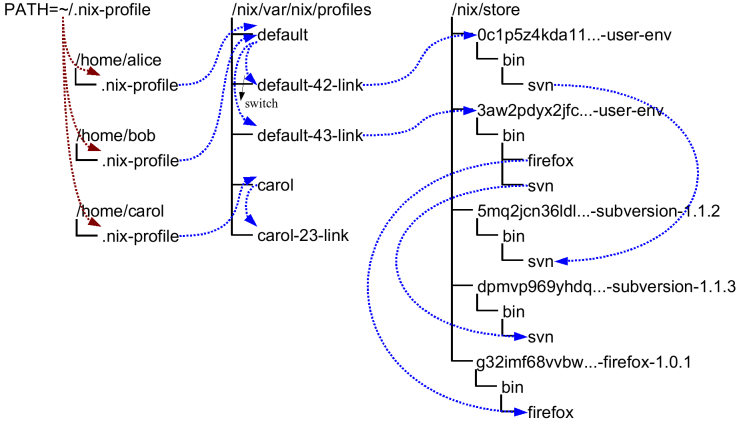

# Nix, a declarative package manager {#Cover}

*By [Julien Tanguy](http://twitter.com/jutanguy)*

## **Managing systems is hard**

## Trying out software

### Install

- The easy way: `<package manager> install`
- The hard way: `./configure`, `make`, `make install`
- The YOLO way: `curl <url> | sudo bash`

### Uninstall

- `<package manager> uninstall`

## **Multiple versions of the same package is hard**

## One problem: hardcoding the FHS

- `/bin`: binaries
- `/opt`: software installed system-wide using automatic installers
- `/etc`: system-wide configuration files
- `/lib`: libraries
- `/usr`: kitchen sink

## Solutions

- Per-language sandboxes: virtualenv, rvm, nvm, stack
- Containers

## **Nix**

## Derivations

- Small building block
- Derived explicitly from each other

## Examples (1/4)

~~~
$ which bash
/home/jtanguy/.nix-profile/bin/bash
~~~

## Examples (2/4) {#large1}

~~~
$ ls -l /home/jtanguy/.nix-profile/bin/bash
lrwxrwxrwx 1 root nixbld 64 Jan 1 1970 /home/jtanguy/.nix-profile/bin/bash
-> /nix/store/vk7prf4l272piwb95vjgms98bb4kmy5n-systemTools/bin/bash
~~~

## Examples (3/4) {#large2}

~~~
$ ls -l /nix/store/vk7prf4l272piwb95vjgms98bb4kmy5n-systemTools/bin/bash
lrwxrwxrwx 5 root nixbld 65 Jan  1  1970 /nix/store/vk7prf4l272piwb95vjgms98bb4kmy5n-systemTools/bin/bash
-> /nix/store/f88s4fcjfk1spdc7rmm9lylxmh0a72dy-bash-4.3-p39/bin/bash
~~~

## Examples (4/4) {#large3}

~~~
$ tree /bin
/bin
└── sh -> /nix/store/r31zljmxj1vk3syp51rrh1zgq0a00lkk-bash-4.3-p42/bin/sh
tree /usr/
/usr/
└── bin
    └── env -> /nix/store/zzj4664wj266mnd8a1l21ggw21g4x2ya-coreutils-8.24/bin/env
~~~

## /nix/store

~~~
$ ls /nix/store/ | perl -n -e 'print if (rand() < .001)'
01ch86ngc5g19c3rc8sh0f2fn0faywmg-etc-file.drv
0jqq7a3ldzq737vdvbgf7nkylbw2lga9-asciidoc-8.6.9.drv
0q00vsf4cvksizcyxxnljnc28c0mkizz-XML-Parser-2.41.tar.gz.drv
25gxanz6ipdkp0zl5m5bp4f3n3n0gyx3-serf-1.3.7.tar.bz2.drv
2akh69nmd3ql9chx09sn29jlgcmvj70q-jdk8u60-b24.tar.gz.drv
2q9iqaqfs05jrpv2mnny2nrmbf0xr22r-gamin-0.1.10.drv
4j78b7mhdvbiry62sg9y828jp22ix9bs-groupmems.pam
5lsxlfj9cyy1xv1xbp971pqj6nnfk5m7-perl-Net-SMTP-1.25.drv
5z7mn1v4k9mg9dkxiswyk1j41gvqn8yg-xorg-server-1.17.2
6jp4qazm7iyx3mv7nfxzvxs3kka2vvm7-net-tools-1.60_p20120127084908
6zjz42c0i91xsvfx01v5nj741cgj7mn5-libnet-1.25.tar.gz.drv
778saghsmiq9g9zj668jvv47gww4sxhp-gperf-3.0.4.tar.gz.drv
7pcwfw7kljixgpgixk0ygdfbnj7q5jix-perl-HTTP-Date-6.02.drv
8s2b62s69507dy5m8ipnq2311b7y8svd-python2.7-pysqlite-2.6.3.drv
8xfh61cs67rrx3hb8zjwmxnig76j0zw7-libXau-1.0.8
a45l8r0zqfr5jhqswqqcya28h59n63js-python2.7-setuptools-18.2
ag7j95gp028d56l8jqjrsn1j3a3f1v13-unit-update-locatedb.service.drv
b44c5l6pd3dx616rgflwv9j898bv3k90-libspectre-0.2.7
bqqb8yv40cwhsgkxv5dxphyp4drk2npr-cups-filters-1.0.71.drv
c8h0pjydbfkfva11h6nq0vf8pycwld4n-unit-script.drv
cllkq1paw5m27l97pgsh07w41dmg9m2k-vifm-0.8
~~~

## Example derivation

~~~
$ tree -L 3 /nix/store/cllkq1paw5m27l97pgsh07w41dmg9m2k-vifm-0.8/
/nix/store/cllkq1paw5m27l97pgsh07w41dmg9m2k-vifm-0.8/
├── bin
│   ├── vifm
│   ├── vifm-convert-dircolors
│   ├── vifm-pause
│   └── vifmrc-converter
└── share
    ├── applications
    │   └── vifm.desktop
    ├── doc
    │   └── vifm
    ├── man
    │   └── man1
    ├── pixmaps
    │   └── vifm.png
    └── vifm
        ├── colors
        ├── vifm-help.txt
        ├── vifmrc
        ├── vifmrc-osx
        ├── vim
        └── vim-doc

12 directories, 9 files
~~~

## Hello world

~~~
$ nix-env -i hello
~~~

## Dependencies

~~~
$ nix-store -q --references `which hello`
/nix/store/483br9kb3f5igsgmb6aqsjhl2ipj2bxr-glibc-2.21
/nix/store/2d8ywxqjnzw7vnd3wlwi10mz27amxq73-hello-2.10

$ nix-store -q --requisites `which hello`
/nix/store/vxmc3nak51czzwjyd4kf8da6vh62lbf7-linux-headers-3.18.14
/nix/store/483br9kb3f5igsgmb6aqsjhl2ipj2bxr-glibc-2.21
/nix/store/2d8ywxqjnzw7vnd3wlwi10mz27amxq73-hello-2.10
~~~

## Reverse-dependencies

~~~
$ nix-store -q --referrers `which hello`
/nix/store/2d8ywxqjnzw7vnd3wlwi10mz27amxq73-hello-2.10
/nix/store/7cv5hzvwqh09mwlw3cqryayw4rzdc7ak-env-manifest.nix
/nix/store/amiwbqpq4fdxr7hgi0r02i4j8m3zwpma-user-environment
~~~

## Reproducible builds

- Gratuitous variables are set to their mathematical equivalent of zero
  - time/date
  - environment
  - non-essential file system contents (the build is chrooted)

- All essential variables (called build inputs) count into the hash:
  - build toolchain – compiler / linker / etc.
  - other build time dependencies – libc, libraries, make, coreutils, etc
  - runtime dependencies

## Anatomy of a derivation

~~~
$ ls -d1 /nix/store/*hello*
/nix/store/1q95rws0xlpkdrv2qhp1rk604p6071g9-hello-2.10.tar.gz.drv
/nix/store/2d8ywxqjnzw7vnd3wlwi10mz27amxq73-hello-2.10
/nix/store/pxqaxi1a6zlvxmaf5ly8384pnp0xvlln-hello-2.10.drv
~~~

## .nix, .drv, $out

- .nix files are like .c files
- .drv files are intermediate files like .o files.
  The .drv describes how to build a derivation, it's the bare minimum information.
- out paths are then the product of the build

## hello/default.nix {#large4}

~~~
{ stdenv, fetchurl }:
stdenv.mkDerivation rec {
  name = "hello-2.10";
  src = fetchurl {
    url = "mirror://gnu/hello/${name}.tar.gz";
    sha256 = "0ssi1wpaf7plaswqqjwigppsg5fyh99vdlb9kzl7c9lng89ndq1i";
  };
  doCheck = false;
  meta = {
    description = "A program that produces a familiar, friendly greeting";
    longDescription = ''
      GNU Hello is a program that prints "Hello, world!" when you run it.
      It is fully customizable.
    '';
    homepage = http://www.gnu.org/software/hello/manual/;
    license = stdenv.lib.licenses.gpl3Plus;
    maintainers = [ stdenv.lib.maintainers.eelco ];
    platforms = stdenv.lib.platforms.all;
  };
}
~~~

## Driver files {#large5}

~~~
$ pp-aterm -i /nix/store/pxqaxi1a6zlvxmaf5ly8384pnp0xvlln-hello-2.10.drv
Derive(
  [("out", "/nix/store/2d8ywxqjnzw7vnd3wlwi10mz27amxq73-hello-2.10", "", "")]
, [ ("/nix/store/1q95rws0xlpkdrv2qhp1rk604p6071g9-hello-2.10.tar.gz.drv", ["out"])
  , ("/nix/store/fbb8inkvx11j7zcydd8ml14730dlhnaz-bash-4.3-p42.drv", ["out"])
  , ("/nix/store/s3z22h3cc16kd1mb12wxdrnzv877hnb6-stdenv.drv", ["out"])
  ]
, ["/nix/store/9krlzvny65gdc8s7kpb6lkx8cd02c25b-default-builder.sh"]
, "x86_64-linux"
, "/nix/store/7d2g3bvmbi5ps3vlkl54h7d7yasc4ynv-bash-4.3-p42/bin/bash"
, ["-e", "/nix/store/9krlzvny65gdc8s7kpb6lkx8cd02c25b-default-builder.sh"]
, [ ("buildInputs", "")
  , ("builder", "/nix/store/7d2g3bvmbi5ps3vlkl54h7d7yasc4ynv-bash-4.3-p42/bin/bash")
  , ("doCheck", "")
  , ("name", "hello-2.10")
  , ("nativeBuildInputs", "")
  , ("out", "/nix/store/2d8ywxqjnzw7vnd3wlwi10mz27amxq73-hello-2.10")
  , ("propagatedBuildInputs", "")
  , ("propagatedNativeBuildInputs", "")
  , ("src", "/nix/store/3x7dwzq014bblazs7kq20p9hyzz0qh8g-hello-2.10.tar.gz")
  , ("stdenv", "/nix/store/7d5l5syxhqx26cd1m8hrj7ld9pmdw5xa-stdenv")
  , ("system", "x86_64-linux")
  ]
)
~~~

## Profiles

<!-- Image from http://nixos.org/nix/manual/#sec-profiles -->

## **Killer feature: `nix-shell`**

## Example: test docker

~~~bash
$ nix-shell -p docker
# Hack hack hack
$ exit
$ nix-collect-garbage
~~~

## References

- [Knowing your system, pt.1 -- @Keruspe](http://www.imagination-land.org/posts/2012-11-22-knowing-your-system-part-basics-on-unixlike-systems.html)
- [Nix pills series -- @Lethalman](http://lethalman.blogspot.it/search/label/nixpills)
- <http://jtanguy.github.io/nix-talk>
